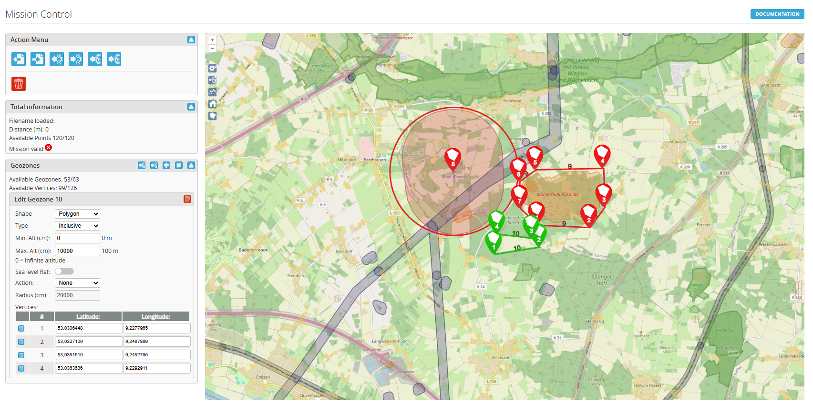
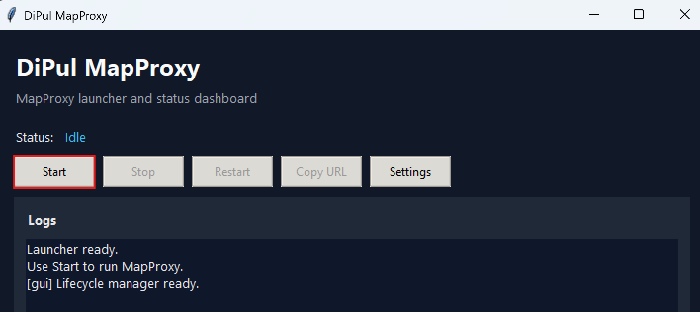
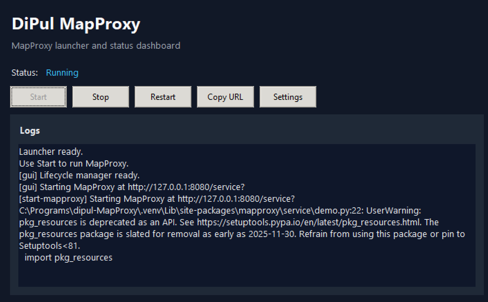

# What this project does

This is a small GUI launcher that starts a local MapProxy server for iNav, containing information about restricted flight zones in Germany as provided by DiPul.

Example map view in iNav with DiPul layers:



# DiPul MapProxy GUI Quickstart

## 1) Install requirements

```bash
python -m venv .venv
```

Windows PowerShell:

```powershell
.\.venv\Scripts\Activate.ps1
pip install -r requirements.txt
```

Linux/macOS:

```bash
source .venv/bin/activate
pip install -r requirements.txt
```

## 2) Launch the GUI

```bash
python launch-gui.py
```

## 3) Start MapProxy and copy URL

1. Click `Start` in the GUI.
2. Wait until status shows `Running`.
3. Click `Copy URL`.

### Startup screenshots




Default URL is usually:

- `http://127.0.0.1:8080/service?`

## 4) Configure iNav

For the full step-by-step setup with screenshots, see:

- [docs/inav-walkthrough.md](docs/inav-walkthrough.md)

Quick values in iNav Configurator:

1. Map provider: `MapProxy`
2. MapProxy URL: paste the copied URL
3. MapProxy layer: choose one of:
   - `inav_dipul_base`
   - `inav_dipul_temp_nfz`
   - `inav_dipul_all`

That is it for V1.
