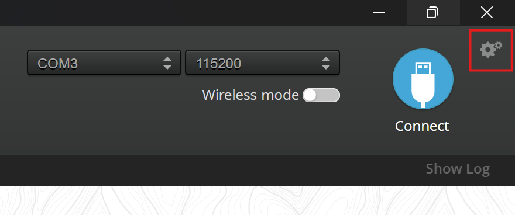
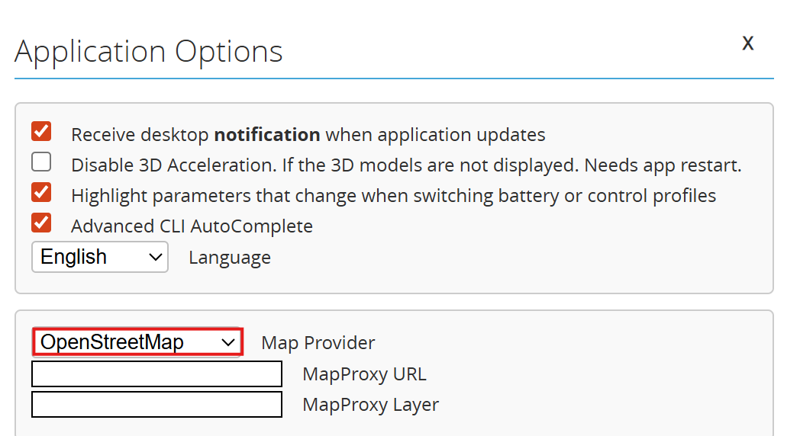
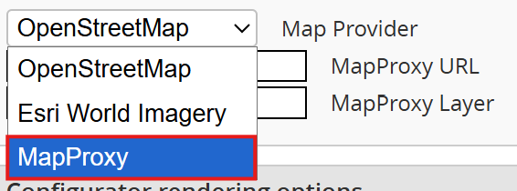
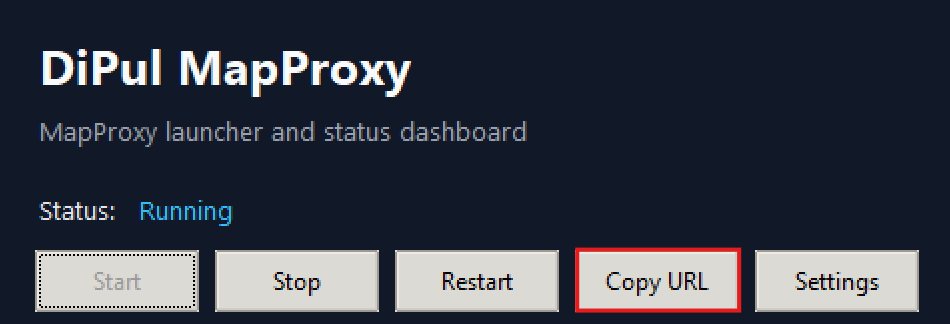
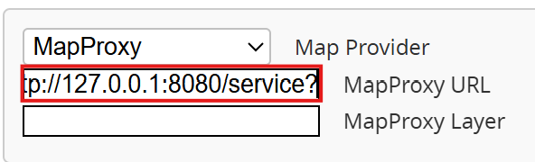
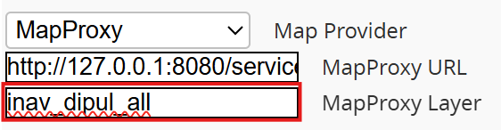

# iNav Configuration Walkthrough

Use this after the GUI is running and you already copied the URL.

## Layer options

Choose one of these layers in iNav:

- `inav_dipul_base`
- `inav_dipul_temp_nfz`
- `inav_dipul_all`

## Step-by-step (with screenshots)

### 1) Locate the settings button in iNav Configurator

### 2) Open the map provider dropdown

### 3) Select `MapProxy` from the provider dropdown

### 4) Copy the URL from the DiPul MapProxy GUI

### 5) Paste the URL into iNav Configurator

### 6) Choose the map layer and paste it into iNav Configurator

### Example view

